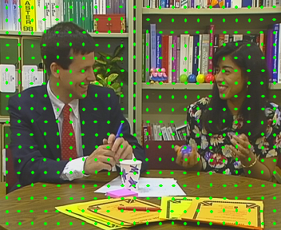

# Video Coding Project - Question 2

This repository contains code and diagrams for motion estimation in video coding using different block matching algorithms.

## Question 2

This section focuses on implementing and comparing the performance of Hexagonal Search Block matching and Full Search block matching algorithms.

### Files

- `question2.py`: The Python script for motion estimation and generating motion vectors.
- `diagram_1.png`, `diagram_1D.png`: Diagrams showing the current frame in the video.
- `diagram_2.png`, `diagram_2D.png`: Diagrams showing the reference frame in the video.
- `diagram_3.png`, `diagram_3D.png`: Diagrams showing the absolute difference between the current and reference frames.
- `diagram_4.png`, `diagram_4D.png`: Diagrams showing the motion vectors obtained using Hexagonal Search Block matching.
- `diagram_5.png`, `diagram_5D.png`: Diagrams showing the estimated frames using Hexagonal Search Block matching.
- `diagram_6.png`, `diagram_6D.png`: Diagrams showing the absolute difference between the estimated frames and the current frames.
- `paris_cif.yuv`: Input video file used in the motion estimation experiments.
- `question2.html`: HTML file (if any) related to Question 2.

### Usage

1. Make sure the required dependencies are installed (NumPy, OpenCV, imageio).
2. Place the necessary files in the same directory as the `question2.py` script.
3. Run the `question2.py` script.
4. The script will perform motion estimation using Hexagonal Search Block matching and Full Search block matching algorithms, generate motion vectors, and save the resulting diagrams.

### Dependencies

- NumPy
- OpenCV
- imageio

### Diagrams

#### Diagram 1: Current Frame

#### Diagram 2: Reference Frame

#### Diagram 3: Absolute Difference

#### Diagram 4: Motion Vectors (Hexagonal Search Block matching)

#### Diagram 5: Estimated Frames (Hexagonal Search Block matching)

#### Diagram 6: Absolute Difference (Estimated Frames)

### Results

The script calculates and prints the Peak Signal-to-Noise Ratio (PSNR) between different frames using the Hexagonal Search Block matching and Full Search block matching algorithms.

## License

This project is licensed under the [MIT License](LICENSE).
