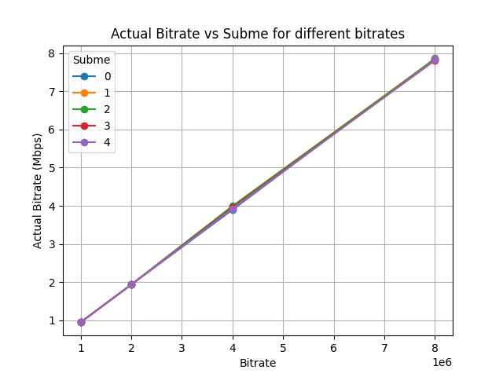
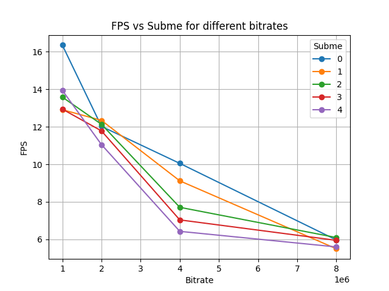
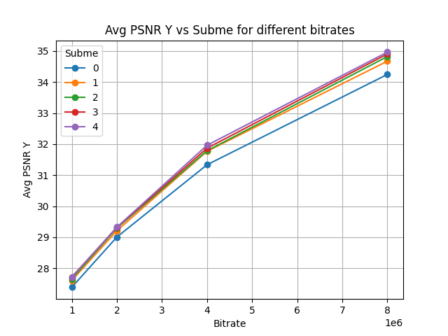

# Video Coding Project - Question 3

This repository contains code and diagrams for analyzing the performance of different bitrates and encoding settings using the Kvazaar video encoder.

## Question 3

This section focuses on analyzing the bitrate, FPS (Frames Per Second), and PSNR (Peak Signal-to-Noise Ratio) values obtained from the Kvazaar video encoder.

### Files

- `question3.py`: The Python script for analyzing the bitrate, FPS, and PSNR values.
- `bitrate_plot.png`: Plot showing the actual bitrate values vs. subme (subpixel motion estimation) for different bitrates.
- `fps_plot.png`: Plot showing the FPS values vs. subme for different bitrates.
- `psnr_plot.png`: Plot showing the Avg PSNR Y (luminance) values vs. subme for different bitrates.
- `kvazaar_test.ps1`, `kvazaar_test.ps1.bak`: PowerShell script files (if any) related to Kvazaar testing.
- `log_bitrate_*_subme_*.txt`: Log files containing the output from Kvazaar encoding with different bitrates and subme values.
- `output_bitrate_*_subme_*.hvc`: Output video files encoded using Kvazaar with different bitrates and subme values.
- `road_movie_1920x1080_25-001.yuv`: Input video file used for encoding and testing.

### Usage

1. Place the necessary files in the same directory as the `question3.py` script.
2. Make sure the required dependencies are installed (glob, os, re, pandas, matplotlib).
3. Run the `question3.py` script.
4. The script will read the log files, extract the bitrate, subme, FPS, Avg PSNR Y, and actual bitrate values, and generate the corresponding plots.

### Dependencies

- glob
- os
- re
- pandas
- matplotlib

### Plots

#### Bitrate Plot

#### FPS Plot

#### PSNR Plot

### Results

The script reads the log files generated by the Kvazaar video encoder and extracts the bitrate, subme, FPS, Avg PSNR Y, and actual bitrate values. It then creates three plots:

- Bitrate Plot: Shows the actual bitrate values vs. subme for different bitrates.
- FPS Plot: Shows the FPS values vs. subme for different bitrates.
- PSNR Plot: Shows the Avg PSNR Y values vs. subme for different bitrates.

## License

This project is licensed under the [MIT License](LICENSE).
